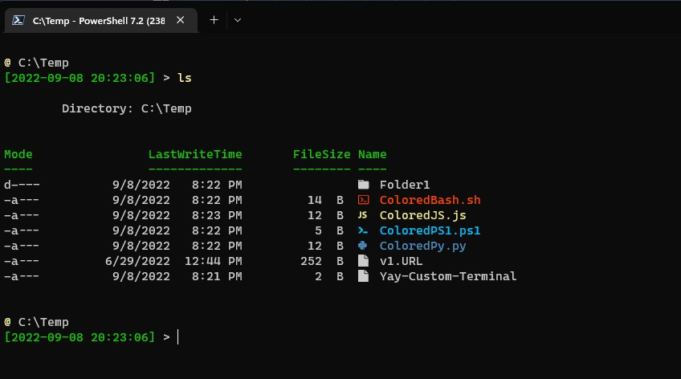
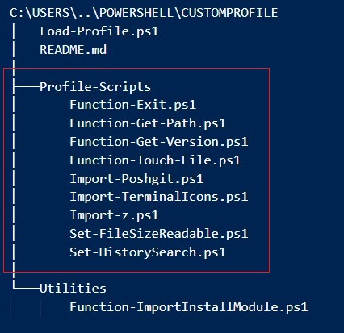

# Table of Contents <!-- omit in toc -->

- [CustomProfile](#customprofile)
  - [Description](#description)
  - [Requirements](#requirements)
  - [Installation](#installation)
  - [Features](#features)
    - [Modules](#modules)
    - [Functions](#functions)
    - [Utilities](#utilities)
    - [Aliases](#aliases)
  - [Flexibility](#flexibility)
  - [FAQ](#faq)

# CustomProfile

## Description

A powershell profile with icons and quality of life basics

Here is an example of the visual changes this profile applies:

>

## Requirements

- Windows 10 or higher
- Powershell 5.1 or higher
- A Nerd font for the Terminal-Icons module to work properly, you can find instructions on how to install the font here: [How to get Terminal Icons font working](https://gist.github.com/markwragg/6301bfcd56ce86c3de2bd7e2f09a8839?permalink_comment_id=3528810#gistcomment-3528810)

## Installation
1. Clone the repository from github into your Powershell profile directory.

`git clone https://github.com/ericbuschman/MyProfile.git`

2. Alternatively download the zip file from GitHub and place it in your powershell directory: [Download Link](https://github.com/ericbuschman/MyProfile/archive/refs/heads/main.zip)

The project should be located in a folder something like:
> C:\Users\\{username}\Documents\Powershell\CustomProfile\

3. A simple example of a profile calling CustomProfile would be:
> C:\Users\\{username}\Documents\Powershell\Microsoft.PowerShell_profile.ps1

`. $PSScriptRoot\CustomProfile\Load-Profile.ps1`

## Features

### Modules
- Posh-Git (customized prompt) [Link](https://github.com/dahlbyk/posh-git)
- Terminal-Icons [Link](https://github.com/devblackops/Terminal-Icons)
- Z [Link](https://github.com/badmotorfinger/z)

### Functions
- `x` - Simple function for the `exit` command
- `Get-Path` - Pulls the environment path variables and sorted readable list of paths
- `ver` - Gets the version of powershell
- `touch` - Updates the timestamp of a file
- `Remove-MergedBranches` - Removes git branches that are merged on both local and remote

### Utilities
- `Install-Font` - Based off of the solution provided here: [Github - anthonyeden/FontInstallation.ps1](https://gist.github.com/anthonyeden/0088b07de8951403a643a8485af2709b)
- `Invoke-ImportInstallModule` - Function which will attempt to import a module and if not found install from the Powershell Gallery to the CurrentUser profile

### Aliases
- `g` - Alias for the GIT program

## Flexibility

One of the features of this custom profile is the flexibility of the loaded modules and functions in your profile.  Due to the nature of looping through files in your Profile-Scripts folder based on the extension `.ps1`, if you change that extension name it will no longer be loaded in the future.  

Let's say you don't ever want to use the simple function `x` to exit your powershell window.  Then you could either delete the file `Function-Exit.ps1` or rename it to `Function-Exit.ps1.disabled`.  The second option leaves you the flexibility of having that available to you in the future.

>


## FAQ
1. PSReadLine issues:
> If you encounter and issue relating to the `Set-PSReadLineOption` commands, this is probably due to the version of your PSReadLine module and it needs to be upgraded.  I'm not doing this automatically in the script.  Follow instructions here: [Upgrading PSReadLine](https://github.com/PowerShell/PSReadLine#upgrading)
2. Execution Policy
> Due to the fact that you are getting these files from the internet, your system may not allow you to run the files as they aren't trusted.  There are multiple ways you can get around this, I will provide two.
> <br/>**First** you can unblock the file which flags it as no longer downloaded from the internet [Unblock-File Info](https://docs.microsoft.com/en-us/powershell/module/microsoft.powershell.utility/unblock-file?view=powershell-7.2):
``` 
syntax: Unblock-File -Path <path to ps1 files>
example: Get-ChildItem .\*.ps1 -recurse | Foreach-Object { Unblock-File $_.FullName }
```
> **Second** (and not as recommended) you can set your execution policy to Bypass and allow all scripts to be run:
``` 
Set-ExecutionPolicy Bypass 
```